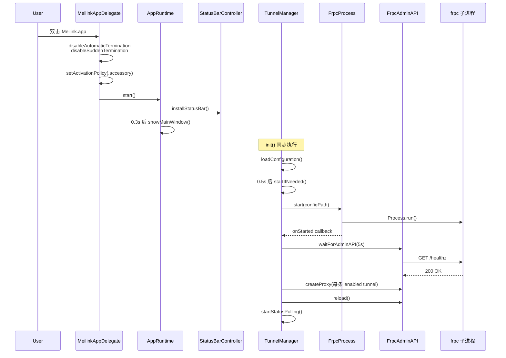
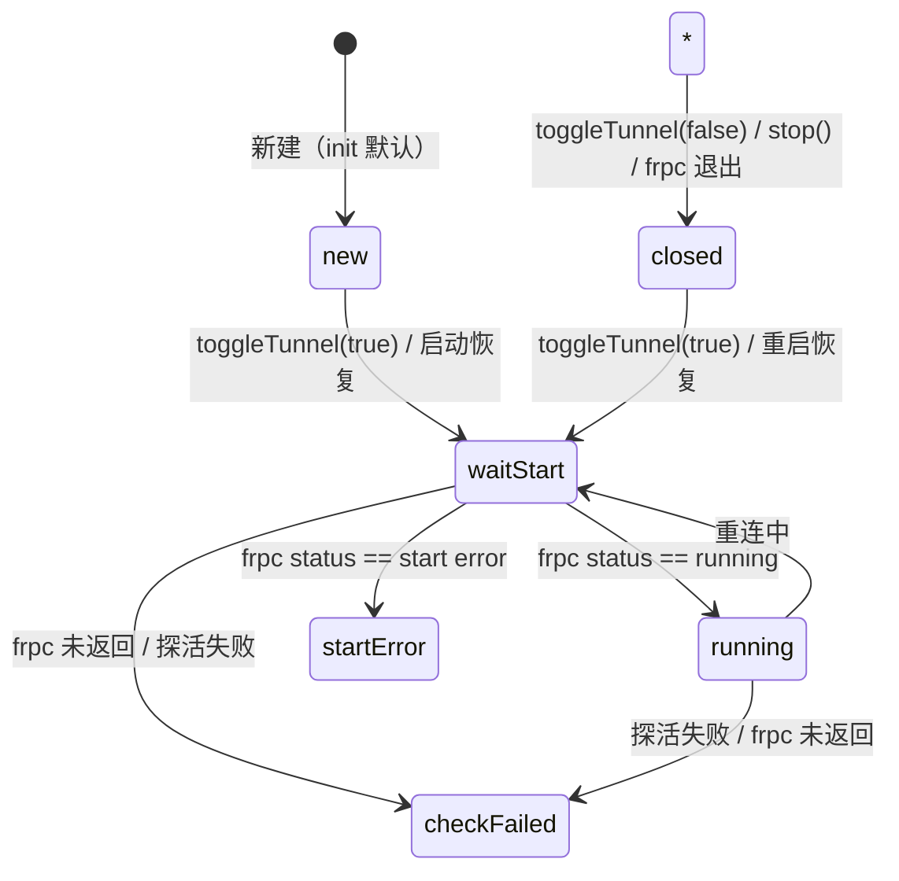

# Meilink SDD · 03 · 技术架构

> 本文描述 Meilink macOS 原生客户端的运行时架构、对象关系、状态机、并发模型与自动恢复策略。事实基线：`client/macos-native/` 下的 Swift 实现。

## 1. 全局运行时拓扑

```mermaid
flowchart TD
    App[MeilinkAppDelegate<br/>@MainActor]
    Runtime[AppRuntime.shared<br/>单例]
    Manager[TunnelManager<br/>ObservableObject @MainActor]
    Windows[AppWindowController<br/>多窗口管理]
    Status[StatusBarController<br/>菜单栏 + Popover]
    FrpcProc[FrpcProcess<br/>Process 封装]
    AdminAPI[FrpcAdminAPI<br/>URLSession + Basic Auth]
    ConfigGen[ConfigGenerator<br/>frpc.toml 生成]
    Store[TunnelStore<br/>JSON 持久化]
    Keychain[KeychainHelper<br/>Token 存储]
    Probe[TunnelReachabilityProbe<br/>NWConnection TCP 探活]
    AutoStart[AutoStartManager<br/>SMAppService]
    FrpcSubprocess[frpc 子进程<br/>v0.70.0]

    App --> Runtime
    Runtime --> Manager
    Runtime --> Windows
    Runtime --> Status
    Manager --> FrpcProc
    Manager --> AdminAPI
    Manager --> ConfigGen
    Manager --> Store
    Manager --> Keychain
    Manager --> Probe
    Status -.subscribe.-> Manager
    Windows --> Manager
    FrpcProc --> FrpcSubprocess
    AdminAPI -.HTTP.-> FrpcSubprocess
```

引用：<kfile name="AppRuntime.swift" path="client/macos-native/App/AppRuntime.swift">AppRuntime.swift</kfile> / <kfile name="TunnelManager.swift" path="client/macos-native/Core/TunnelManager.swift">TunnelManager.swift</kfile>。

## 2. 启动序列



## 3. 核心对象职责

### 3.1 `MeilinkAppDelegate`（<kfile name="MeilinkApp.swift" path="client/macos-native/App/MeilinkApp.swift">MeilinkApp.swift</kfile>）
- 单例式 `@MainActor` 入口
- 控制生命周期：`disableAutomaticTermination` / `disableSuddenTermination` 防后台杀
- `allowQuit` 静态标志：默认 `false`，`applicationShouldTerminate` 返回 `terminateCancel`；只有用户显式退出时设 `true`
- `applicationDidFinishLaunching` → `start()`
- `applicationWillTerminate` → `manager.killFrpcOnExit()`
- `applicationShouldHandleReopen` → `showMainWindow()`（Dock/Spotlight 唤起）

### 3.2 `AppRuntime`（单例）
- 持有 `manager: TunnelManager`、`windows: AppWindowController`、`statusBar: StatusBarController`
- 提供 `installStatusBar()` / `rebuildStatusBar()` 入口
- 所有窗口和菜单栏共享同一个 `manager` 实例，保证状态一致

### 3.3 `TunnelManager`（@MainActor ObservableObject）
- 状态：`tunnels / isConnected / isFrpcRunning / serverConfig / events / isConfigured / appSettings`
- 持有：`frpcProcess / adminAPI? / configGenerator / store / reachabilityProbe`
- 内部计时器：`statusTimer`
- 内部标志：`isPollingStatus / isRecovering / consecutiveFailures / lastRecoveryAt / lastReachabilityProbeAt`
- 关键阈值（硬编码常量）：
  - `maxConsecutiveFailuresBeforeRecovery = 3`
  - `recoveryCooldown = 20` 秒
  - `statusPollingInterval` 运行时 clamp `[3, 30]`
  - `remoteReachabilityInterval` 运行时 clamp `[30, 600]`

### 3.4 `FrpcProcess`（非 MainActor）
- `Process` 封装，提供 `start / stop / stopImmediately / kill -9` 兜底
- 回调：`onOutput` / `onTermination` / `onStarted`
- frpc 二进制查找顺序：`Bundle.main.executableURL.deletingLastPathComponent()/frpc` → `Bundle.main.path(forResource: "frpc")` → 失败
- stdout/stderr 通过 `Pipe.readabilityHandler` 异步按行回调
- `terminationHandler` 在主线程派发 `onTermination(status, intentional)`
- **主动停止标记**：`stop` / `stopImmediately` 先 `markIntentionalStop()`，`terminationHandler` 派发时 `consumeIntentionalStop()` 得到 `intentional`，连同退出码一起传给上层。被终止信号杀掉的进程退出码非 0（信号值），但 `intentional=true`，不应被当作崩溃

#### 跨平台 Go 实现对齐（`client/desktop/sidecar/internal/frpc/process.go`）
Go 端 `Process` 同样提供 `OnOutput func(line string)` 与 `OnTermination func(status int, intentional bool)` 回调：
- `Start` 用 `io.Pipe` + `bufio.Scanner` 按行扫描 stdout/stderr，trim 后非空行回调 `OnOutput`
- 开 goroutine 调 `cmd.Wait()`，结束后 `consumeIntentionalStop()` 取得 `intentional`，调 `OnTermination(status, intentional)`
- `Stop` / `StopImmediately` 先 `markIntentionalStop()`，再 `Kill` + 关 logFile + 置 nil（不调 `cmd.Wait()`，由 Wait goroutine 拥有）
- Windows 平台 `applyPlatformAttrs` 设置 `SysProcAttr{CreationFlags: 0x08000000}` (CREATE_NO_WINDOW) 隐藏控制台
- `TunnelManager.NewManager` 注册回调：`OnOutput` 把每行作为 `frpc: <line>` 事件；`OnTermination` 仅在 `!intentional && status != 0`（真正崩溃）时 sleep 2s 防抖后 `recoverConnection`，状态置 closed

### 3.5 `FrpcAdminAPI`（非 MainActor）
- baseURL = `http://127.0.0.1:<adminPort>`
- Basic Auth header 预编码
- `URLSessionConfiguration.default.timeoutIntervalForRequest = 10`
- `decoder.keyDecodingStrategy = .convertFromSnakeCase`（frpc Admin API 返回 snake_case）
- 端点：`/healthz` / `/api/status` / `/api/stop` / `/api/reload` / `/api/store/proxies`（GET/POST/PUT/DELETE）

### 3.6 `ConfigGenerator`（值类型）
- 生成 frpc v0.70.0 兼容 TOML（顶层 key=value 形式，非 [section] 形式，除了 `[store]`）
- 固定模板：`transport.poolCount = 5` / `transport.tcpMux = true` / `transport.tcpMuxKeepaliveInterval = 30`
- `webServer.addr = "127.0.0.1"`（Admin API 只监听本地）
- `[store] path = "<Application Support>/Meilink/store.json"`：让 frpc 自己持久化 proxy，应用启动后通过 Store API 恢复
- 写文件后 `setAttributes posixPermissions: 0o600`

### 3.7 `TunnelStore`（值类型）
- 目录：`~/Library/Application Support/Meilink/`
- 文件：`tunnels.json` / `config.json` / `settings.json` / `frpc.toml`（运行期生成）/ `store.json`（frpc 写）
- 编码：`JSONEncoder` ISO8601 日期 + prettyPrinted；`JSONDecoder` ISO8601 日期
- 容错：load 失败返回默认值（空数组 / nil / AppSettings()）

### 3.8 `KeychainHelper`（静态）
- service = `pub.mei.meilink`
- `kSecAttrAccessible = kSecAttrAccessibleWhenUnlocked`
- 保存前先 `SecItemDelete` 再 `SecItemAdd`（覆盖式）
- 当前仅用于 `auth-token`（`TunnelManager.saveConfiguration` 时同步写）

### 3.9 `TunnelReachabilityProbe`
- TCP `NWConnection`，4s 超时
- `LockedFlag` 私有类保证 continuation 只 resume 一次（防 NSLock 竞态）
- 类型差异见 `02-features.md` F4.2

### 3.10 `AutoStartManager`
- `SMAppService.mainApp` 注册/注销
- `status == .enabled` 判断已启用
- 注：实际"开机后是否自动连接 frpc"由 `AppSettings.autoStart` + `TunnelManager.startIfNeeded` 控制，Login Items 只控制 Meilink.app 本身是否随登录启动

## 4. 隧道状态机



状态来源：<kfile name="Tunnel.swift" path="client/macos-native/Models/Tunnel.swift">Tunnel.swift</kfile> 的 `TunnelStatus`，从 frpc Admin API 的 `status` 字段映射：

| frpc phase | TunnelStatus | displayName | tintColor |
|---|---|---|---|
| `new` | new | 新建 | gray |
| `wait start` | waitStart | 连接中 | yellow |
| `start error` | startError | 启动失败 | red |
| `running` | running | 运行中 | green |
| `check failed` | checkFailed | 检查失败 | red |
| `closed` | closed | 已关闭 | gray |

## 5. 连接状态判定

应用级状态由 `TunnelManager.isConnected` / `isFrpcRunning` 两个 `@Published` 表达：

| `isFrpcRunning` | `isConnected` | 含义 | UI 文案 |
|---|---|---|---|
| false | false | 未启动 / 未配置 | "未配置" 或 "未连接" |
| true | false | frpc 在跑但外网未通 | "连接中" |
| true | true | frpc 在跑且所有隧道健康 | "已连接" |

判定逻辑在 `pollStatus`：

1. `adminAPI.getStatus()` 成功
2. 每条 enabled tunnel 都能匹配到 status 且 `status == running` 且 `errorMessage == nil`
3. 到探活时机且所有 enabled tunnel 都 `reachable`
4. 任一不满足 → `recordConnectivityFailure`，`isConnected = false`

## 6. 自动恢复策略

```mermaid
flowchart TD
    Poll[pollStatus 周期触发]
    Fail{检测失败?}
    Inc[consecutiveFailures += 1]
    First{第1次?}
    Log1[记 warning 日志]
    Ge3{>= 3 次?}
    Cool{距上次恢复 < 20s?}
    Skip[跳过本次恢复]
    Recover[recoverConnection]
    Stop[停轮询 + stopImmediately]
    Sleep[sleep 1s]
    StartForce[start(force: true)]
    Reset[consecutiveFailures = 0]

    Poll --> Fail
    Fail -->|是| Inc
    Inc --> First
    First -->|是| Log1
    First -->|否| Ge3
    Ge3 -->|否| Poll
    Ge3 -->|是| Cool
    Cool -->|是| Skip
    Cool -->|否| Recover
    Recover --> Stop --> Sleep --> StartForce --> Reset
```

**另一条恢复路径**：frpc 进程真正异常退出（`!intentional && status != 0`）时 `FrpcProcess.onTermination` 回调 → sleep 2s → `recoverConnection`。主动停止（`stop` / `stopImmediately` / `recoverConnection` 内部的 kill）触发的退出 `intentional=true`，即使退出码非 0（终止信号的值）也不会触发恢复——否则会形成 kill → 恢复 → kill 死循环。

恢复路径都被 `isRecovering` 标志保护，防止重入。

## 7. 并发与线程模型

### 7.1 MainActor 边界
- `TunnelManager`、`AppRuntime`、`StatusBarController`、`AppWindowController` 全部 `@MainActor`
- 所有 `@Published` 状态的读写都在主线程
- `FrpcProcess` / `FrpcAdminAPI` / `TunnelReachabilityProbe` 非 MainActor，但回调通过 `DispatchQueue.main.async` 派回主线程

### 7.2 重入保护
- `isPollingStatus`：防止 `pollStatus` 重入（Timer 触发 + startStatusPolling 立即触发可能撞一起）
- `isRecovering`：防止 `recoverConnection` 重入
- `LockedFlag`（探活）：保证 continuation 只 resume 一次

### 7.3 异步等 Admin API
- `start()` 用 `waitForAdminAPI`（async/await，5s 超时，500ms 间隔轮询 `/healthz`）
- `restart()` 用 `waitForAdminAPIAsync`（回调式，15s 超时）— 因为 restart 可能从非 async 上下文触发，用回调避免阻塞

### 7.4 进程停止的逐级加强
`FrpcProcess.stopImmediately(timeout:)` 三级兜底：

1. `process.terminate()` → 等 `timeout` 秒
2. `process.interrupt()` → sleep 0.5s
3. `process.interrupt()` 再次 → sleep 0.5s
4. `kill -9 <pid>` → sleep 0.5s

`TunnelManager.restart()` 在这基础上再补一层 `kill -9` 兜底。

## 8. 数据流

### 8.1 持久化数据流
- 用户操作 → `TunnelManager` 方法 → `TunnelStore.saveXxx` 写 JSON
- `saveConfiguration` 额外同步写 Keychain
- `frpc.toml` 在 `start/restart` 时重新生成（不持久化隧道配置，靠 Store API 动态恢复）

### 8.2 运行时状态流
- `FrpcProcess.onOutput` → `addEvent("frpc: ...")` → `events.insert(at: 0)` → UI 自动刷新
- `adminAPI.getStatus()` → 更新 `tunnels[idx].status/errorMessage/remoteAddr` → UI 自动刷新
- `manager.objectWillChange` → `StatusBarController.updateButton` → 菜单栏图标刷新

### 8.3 隧道 CRUD 流
- UI 调 `manager.addTunnel/updateTunnel/deleteTunnel/toggleTunnel`
- 本地 `tunnels` 数组先变 → `store.saveTunnels` → 调 `adminAPI` → `reload`
- `adminAPI` 失败：
  - `addTunnel/updateTunnel/toggleTunnel(true)`：抛错给 UI，UI 显示错误日志
  - `deleteTunnel`：API 失败仅记日志，本地仍删除
  - `toggleTunnel(false)`：`try?` 吞错

## 9. 跨平台架构对齐

跨平台客户端（`client/desktop/sidecar/`）的架构原则（来自 `docs/archive/2026-07-24-cross-platform-native-alignment-design.md`）：

- **Go 是事实来源**：持久化、frpc 配置生成、frpc 进程控制、Store API、本地 HTTP API 全部由 Go sidecar 拥有
- **Tauri 拥有桌面壳**：sidecar 启动、API 发现、托盘、Dock 策略、popover 几何、WebView 窗口
- **Web UI 只消费本地 HTTP API**：不直接碰 frpc、不直接碰文件系统
- **macOS 共享目录**：`~/Library/Application Support/Meilink`，与原生客户端互通
- **其他平台默认目录**：`~/.meilink`

详见 [06-constraints.md](./06-constraints.md) 的"跨平台兼容"一节与 [../rules/cross-platform-compat.md](../rules/cross-platform-compat.md)。
